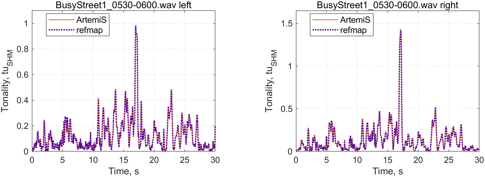
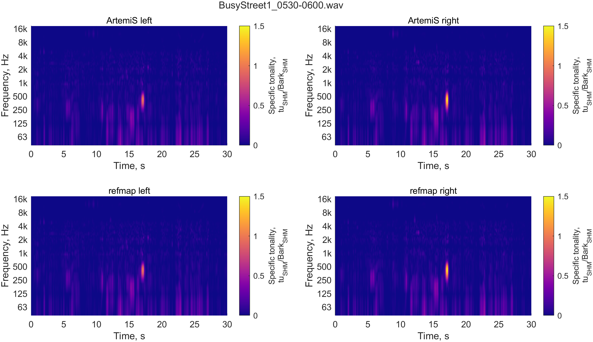
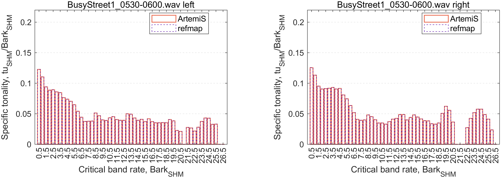
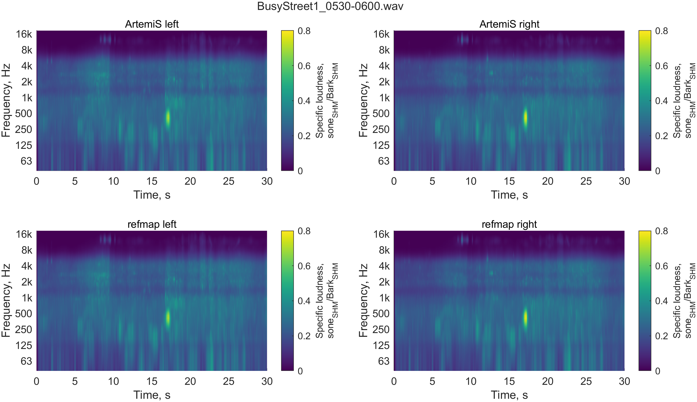
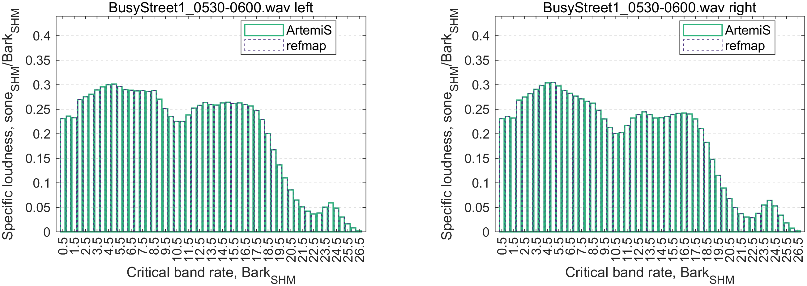
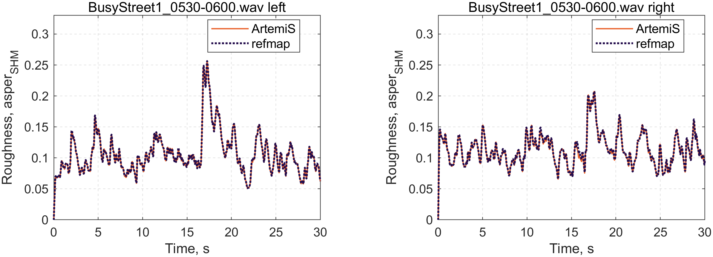
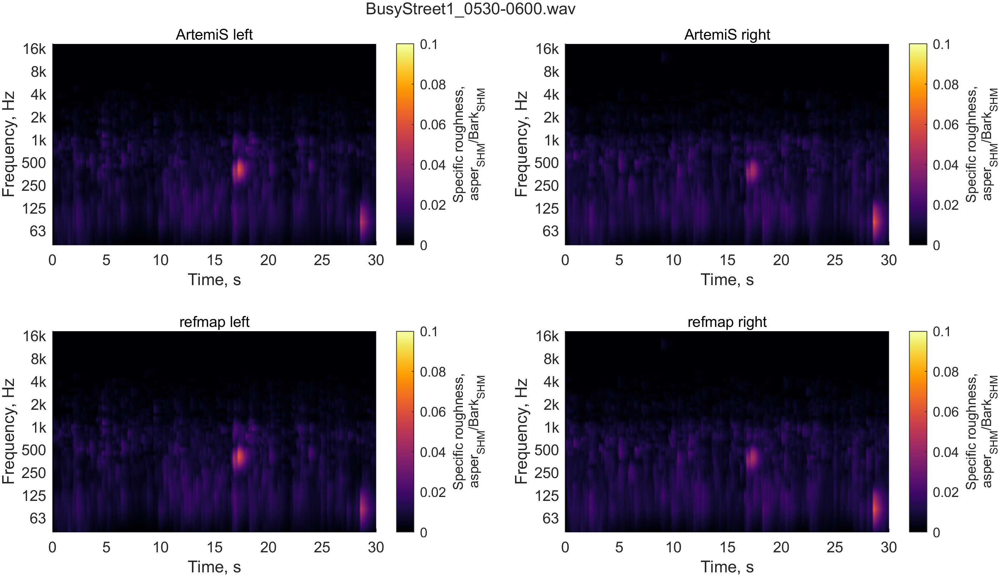
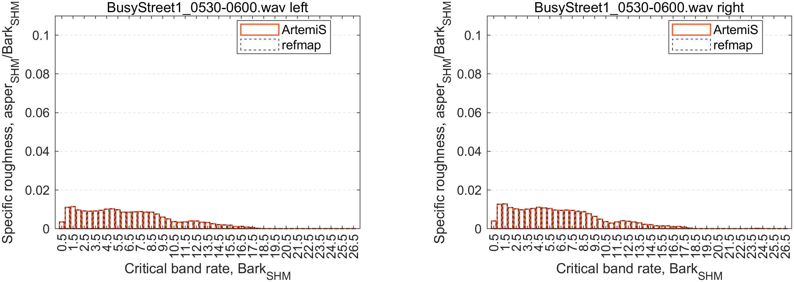

# ECMA-418-2:2024 - Sottek Hearing Model tonality, loudness and roughness sound quality metrics: Verification of MATLAB and Python implementations
Verification of the MATLAB and Python algorithms has been undertaken by comparison with outputs calculated using HEAD Acoustics ArtemiS v16.7 software.

The audio signals used for the verification comprise:
1. reference calibration signal for tonality and loudness: 1 kHz sinusoid at 40 dB sound pressure level (5 seconds, mono)
1. reference calibration signal for roughness: 1 kHz sinusoid modulated at 70 Hz (modulation factor 1), at 60 dB sound pressure level (5 seconds, mono)
1. binaural audio recording of a 'busy city street' environment (30 seconds, 2-channel binaural)

The reference calibration signals 1 and 2 were generated using [acousticSHMGenerateRefSignals.m](mlab/acousticSHMGenerateRefSignals.m).

The binaural audio recording was extracted from the [EigenScape](https://zenodo.org/doi/10.5281/zenodo.1012808) database (Green et al., [2017](https://doi.org/10.3390/app7111204),  licenced under [Creative Commons Attribution 4.0](https://creativecommons.org/licenses/by/4.0)).

The reference ArtemiS results are included in the [reference folder](reference).

Calculated sound quality values and reference comparison figures were generated using the [verification script](mlab/acousticSHMVerification.m), which calls the algorithms from the [ECMA-418-2](../../src/mlab/ECMA_418-2) folder. The full set of comparison plots can be displayed by running the validation script; the selection presented below is sufficient to validate all capabilities of the algorithms.

The values for the Python implementation were calculated using the corresponding [script](py/acousticSHMVerification.py), which calls the algorithms from the [relevant Python folder](../../src/py/metrics/ecma418_2), and saved as .mat files for use in the main [verification script](mlab/acousticSHMVerification.m).

Signal 1 is unmodulated, which yields 0 asper roughness, so time-dependent and specific roughnesses are not displayed for this signal.

## Tonality
### Time-dependent tonality

### Time-dependent specific tonality

### Time-aggregated specific tonality

### Overall tonality

## Loudness
### Time-dependent loudness

### Time-dependent specific loudness

### Time-aggregated specific loudness

### Time-dependent specific binaural loudness

### Overall loudness

## Roughness
### Time-dependent roughness

### Time-dependent specific roughness

### Time-aggregated specific roughness

### Time-dependent specific binaural roughness

### Overall roughness

## Python implementation
The verification results presented here comprise sound quality magnitude *differences* between the time-dependent specific outputs from the Python implementation and the MATLAB equivalents. The resulting values demonstrate that the differences are negligible in all cases (carefully note the scale of the colourbar axes, which are automatically ranged to the max and min differences).

### Tonality

### Loudness

### Roughness

